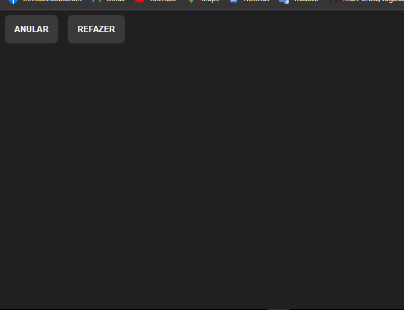
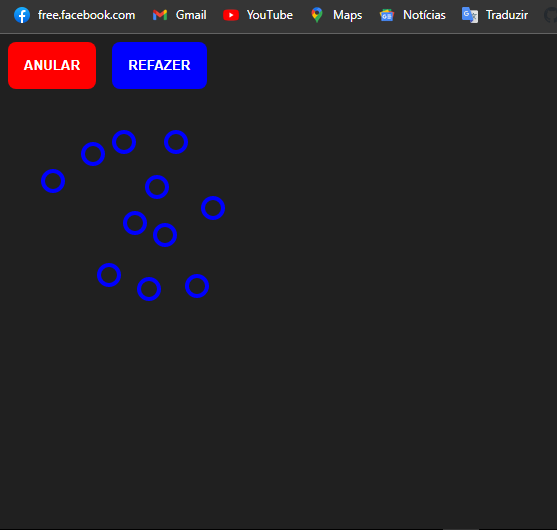

# Projeto Teste para Junior TypeScript com React

Este `Projeto` foi desenvolvido para fins de exercicío com o objetivo de melhorar as minhas `habilidades` em `TypeScript` e `React`. Este `projeto` é basicamente um teste que aconteceu na entrevista de um júnior para uma vaga o projeto permite criar um circulo a cada clique na `tela` e têm dois butões `ANULAR` e `REFAZER` o butão anular vai eliminar os circulos criados pelo usuário ao clicar na tela, e o butão refazer vai repor todos os circulos anulados pelo usuário.

## Tecnologias

As seguintes ferramentas foram usadas na constuição deste projeto:

- HTML
- STYLED-COMPONENTS
- TYPESCRIPT
- REACT

#

Feito por ❤ Pascoal Kahamba meu [Linkedin](https://www.linkedin.com/in/pascoal-kahamba-7b43bb233?lipi=urn%3Ali%3Apage%3Ad_flagship3_profile_view_base_contact_details%3BTg8LEKayToyytOX1pVAQ%2Bg%3D%3D)

[👉Clique aqui para rodar o projeto👈](https://interview-for-junior.vercel.app/)😎
